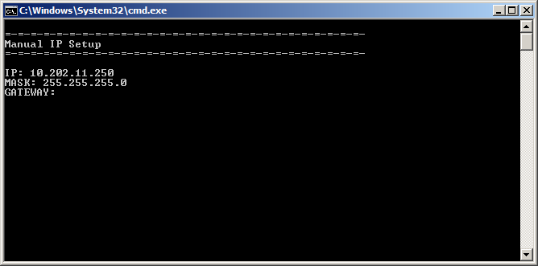
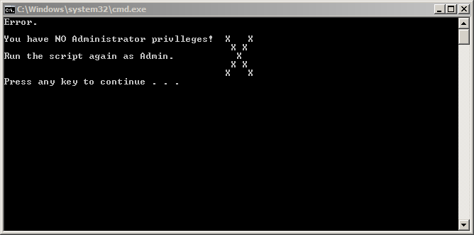
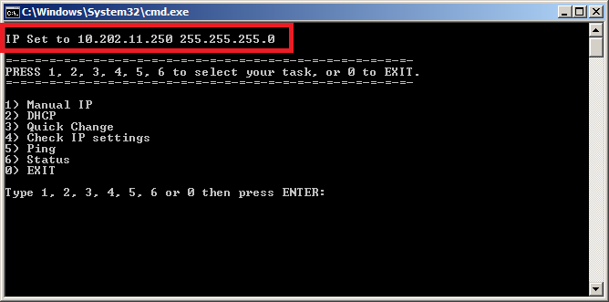
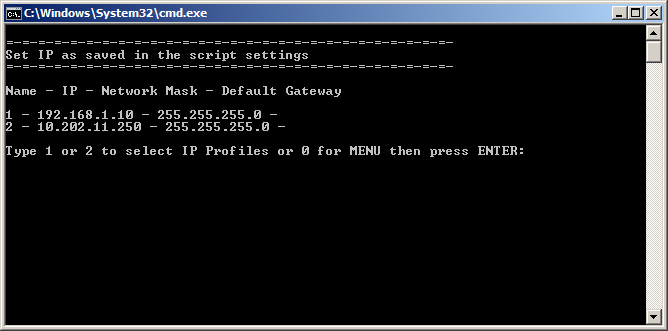

# IP Setting CMD
Check and Setup your IP address easly from cmd.

To change the IP address of your network card you have to go to Settings - Network - Select right adapter - Enter Adapter Parameters - Select IPv4 - Type new settings - Save

This is easy but can be time consuming a specialy when you have to go through the whole procedure many times in short period of time.

To reduce number of steps and time consumed you can use this script so you can applied all the necesary changes using just keyboard.

Before the first run change the name of the adapter in the script so it will match the name of the adapter you want to modify with the script.

---

Run the aplication as Administrator.

The script allows you to:
- See the current IP Settings
- Manualy change the IP address
- Use pre confugured IP Settings (2 Configurations Slots Avaiable)
- Ping IP by just typing the address
- Use DHCP instead of static IP
- See the latest changes applied to a system

Use number to navigate around the script. To modify pre configured IP Settings please edit the bat file - only edit the top of the file.

~~~
REM --------------------------------------------------------
REM Settings
REM --------------------------------------------------------
REM Interface name
set name="Local Area Connection" <--- NAME OF THE NETWORK ADAPTER WHERE YOU WANT TO CHANGE IP SETTINGS, THE NAME YOU CAN FIND USING STATUS OPTION IN THE SCRIPT
REM IP 1
set A_IP=192.168.1.10 <--- IP ADDRESS FOR CONFIGURATION A
set A_MASK=255.255.255.0 <--- NETOWRK MASK ADDRESS FOR CONFIGURATION A
set A_GATEWAY=192.168.1.1 <--- DEFAULT GATEWAY ADDRESS FOR CONFIGURATION A
REM IP 2
set B_IP=10.202.11.250 <--- IP ADDRESS FOR CONFIGURATION A
set B_MASK=255.255.255.128 <--- NETOWRK MASK ADDRESS FOR CONFIGURATION B
set B_GATEWAY=10.202.11.1 <--- DEFAULT GATEWAY ADDRESS FOR CONFIGURATION B
REM --------------------------------------------------------
~~~

#### Welcome Screen

#### Manual IP Settings

#### No Admin Rights

#### Latest Changes Applied

#### Ping

#### Pre Configured Options

#### Current Network Adapters Settings 

